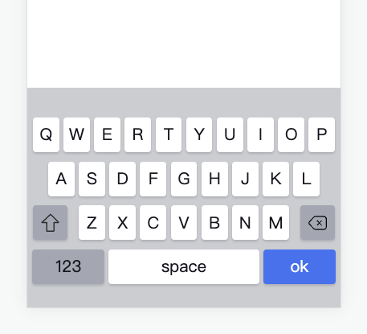

# 基于 VUE3 开发的 keyboard 移动端弹出键盘



## 安装

```sh
npm i keyboard-hmx-vue3
// or
yarn add keyboard-hmx-vue3
```

## 使用

```js
// main.js
import keyBoardHmxVue3 from 'key-board-hmx-vue3'
import 'key-board-hmx-vue3/lib/style.css'

createApp(App).use(keyBoardHmxVue3).mount('#app')
```

```js
// App.vue
<false-textbox/>
<keyboard />
```
